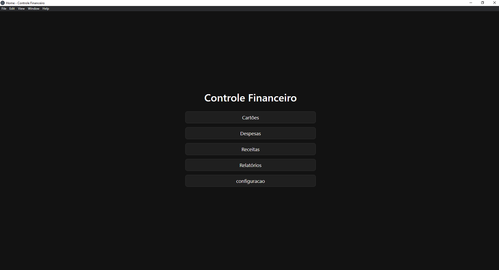
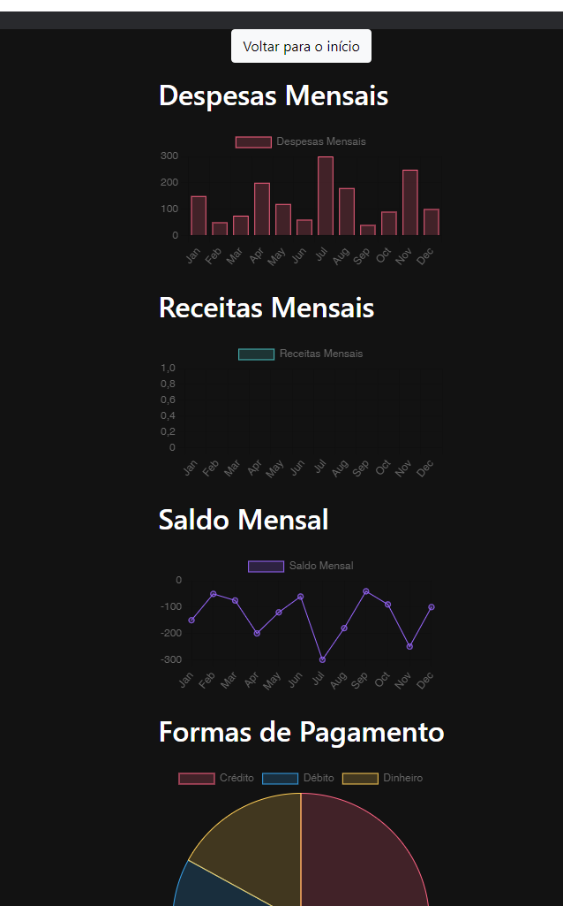

# Sistema Financeiro

Sistema Financeiro é uma aplicação de gerenciamento financeiro pessoal que permite aos usuários controlar suas despesas e receitas, gerar relatórios detalhados e calcular o saldo atual. Desenvolvido com Electron, a aplicação oferece uma interface amigável e intuitiva para facilitar o acompanhamento das finanças pessoais.

## Funcionalidades

- Controle de despesas e receitas
- Geração de relatórios detalhados
- Cálculo do saldo atual
- Interface amigável e intuitiva

## Capturas de Tela

### Tela Principal

### Relatórios

## Instalação

Para instalar o Sistema Financeiro, basta acessar a página de [versões](index.html) e baixar o instalador correspondente ao seu sistema operacional.

## Contribuição

Contribuições são bem-vindas! Sinta-se à vontade para abrir issues e pull requests.

## Licença

Este projeto está licenciado sob a licença MIT. Veja o arquivo [LICENSE](LICENSE) para mais detalhes.

## Autor

Desenvolvido por Diomar Gonçalves.